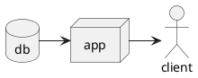

# react_hw1_ex9 #

## Описание проекта ##
### Краткое описание ###
**Репозиторий для задания 9 домашней работы 1**

### Детальное описание ###
> Репозиторий для задания 9 домашней работы 1, в рамках которого необходимо создать проект на stackblitz, сделать описание в ReadMe и добавить UML-схему.

*На странице отображается стандартный текст.*

---

> 1. первый элемент списка.
> 2. второй элемент списка.

*Тут я показываю, что умею делать списки*

## Ссылка на демонстрацию ##
[Демонстрация проекта](https://stackblitz.com/edit/js-zkyabq "Демо")

## Скриншот страницы ##

## Ссылка на видео о README.md ##

|       | field1 | field2 |
|-------|:------:|:------:|
| row 1 | cell1  | cell2  |
| row 2 | cell3  | cell4  |
